# OCP Maintenance AI — Diagramas de Arquitectura

> Generado: 2026-03-15 | Stack: FastAPI + PostgreSQL + React 19 + Docker
> Total: 20 routers, 28 services, 49 tablas DB, 4 agentes IA, 126+ herramientas, 25 paginas frontend

---

## 1. Diagrama UML de Componentes

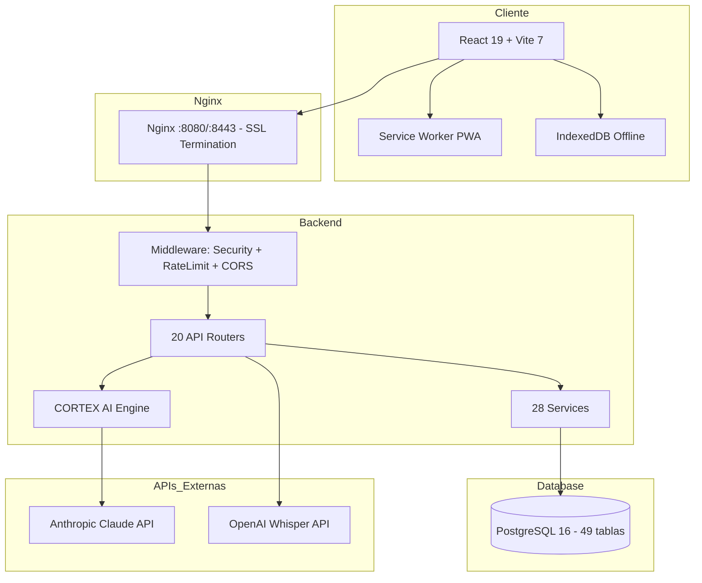

---

## 2. Diagrama de Componentes Detallado — Backend

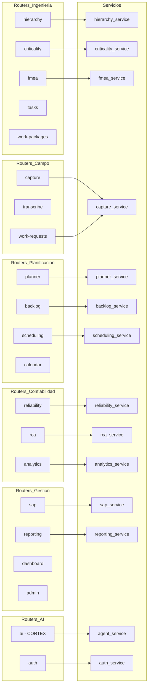

---

## 3. BPMN — Proceso de Mantenimiento Completo

```mermaid
graph LR
    START((Inicio)) --> CAPTURE{Tipo captura?}
    CAPTURE -->|Voz| VOICE[Captura por Voz]
    CAPTURE -->|Texto| TEXT[Captura Texto]
    CAPTURE -->|Imagen| IMAGE[Foto + AI Vision]
    VOICE --> WR[Crear Work Request]
    TEXT --> WR
    IMAGE --> WR
    WR --> AICLASS[AI Clasifica y Prioriza]
    AICLASS --> DUP{Duplicado?}
    DUP -->|Si| MERGE[Fusionar]
    DUP -->|No| VALIDATE[Validar]
    MERGE --> VALIDATE
    VALIDATE --> PLANNER[Planner AI Recomienda]
    PLANNER --> ACTION{Accion?}
    ACTION -->|Aprobar| BACKLOG[Agregar a Backlog]
    ACTION -->|Modificar| PLANNER
    ACTION -->|Escalar| ESCALATE[Escalar a Gerencia]
    ACTION -->|Diferir| DEFER[Diferir]
    ESCALATE --> BACKLOG
    BACKLOG --> OPTIMIZE[Optimizar Backlog]
    OPTIMIZE --> WEEKLY[Programa Semanal]
    WEEKLY --> RESOURCE[Nivelar Recursos]
    RESOURCE --> CONFLICT{Conflictos?}
    CONFLICT -->|Si| RESOURCE
    CONFLICT -->|No| FINALIZE[Finalizar]
    FINALIZE --> GANTT[Generar Gantt]
    GANTT --> EXECUTE[Ejecutar Trabajo]
    EXECUTE --> COMPLETE[Completar Orden]
    COMPLETE --> KPI[Calcular KPIs]
    KPI --> RCAQ{Fallo repetitivo?}
    RCAQ -->|Si| RCA[Analisis RCA]
    RCAQ -->|No| REPORT[Reportes]
    RCA --> CAPA[Crear CAPA]
    CAPA --> REPORT
    REPORT --> ENDX((Fin))
```

---

## 4. BPMN — Proceso CORTEX AI Session (4 Milestones)

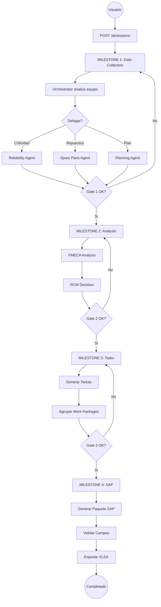

---

## 5. Diagrama de Clases — Database Models (Core)

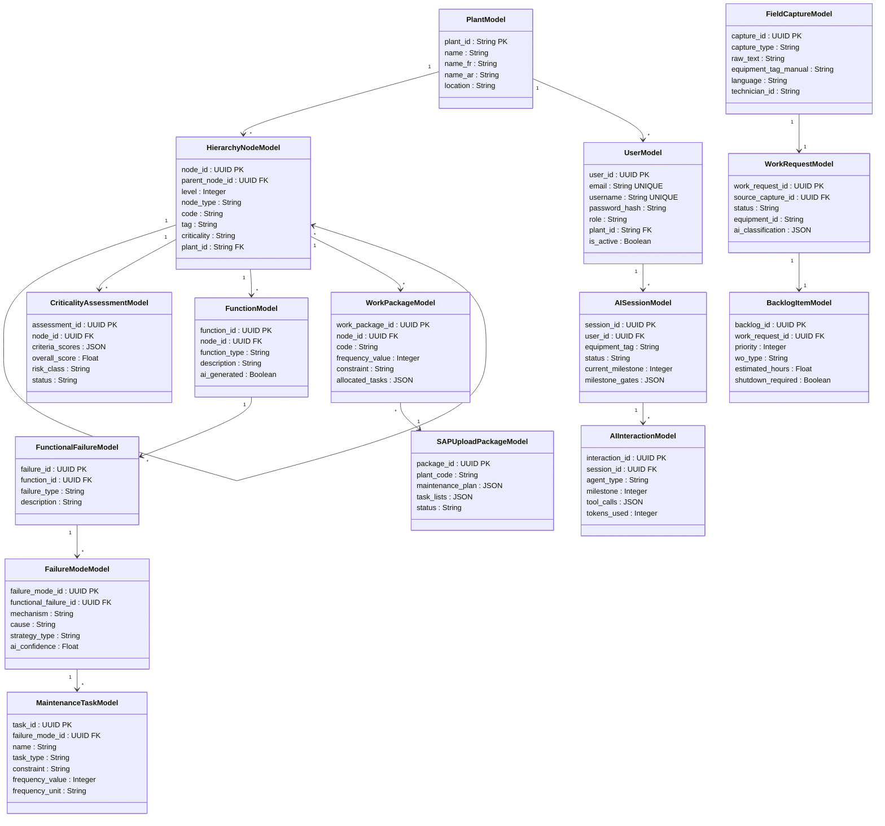

---

## 6. Diagrama de Clases — Models Complementarios

```mermaid
classDiagram
    class RCAAnalysisModel {
        analysis_id : UUID PK
        event_description : String
        plant_id : String
        equipment_id : String
        level : String
        status : String
        cause_effect : JSON
        solutions : JSON
        analysis_5w2h : JSON
    }

    class WeeklyProgramModel {
        program_id : UUID PK
        plant_id : String
        week_number : Integer
        year : Integer
        status : String
        work_packages : JSON
        total_hours : Float
    }

    class TroubleshootingDiagnosticModel {
        diagnostic_id : UUID PK
        equipment_tag : String
        symptom_description : String
        ai_diagnosis : JSON
        probable_causes : JSON
        confidence_score : Float
        resolved : Boolean
    }

    class WorkOrderModel {
        work_order_id : String PK
        equipment_id : String
        order_type : String
        priority : String
        status : String
        actual_duration_hours : Float
    }

    class HealthScoreModel {
        score_id : UUID PK
        node_id : UUID FK
        composite_score : Float
        health_class : String
        trend : String
        recommendations : JSON
    }

    class KPIMetricsModel {
        metrics_id : UUID PK
        plant_id : String
        mtbf_days : Float
        mttr_hours : Float
        availability_pct : Float
        oee_pct : Float
        pm_compliance_pct : Float
    }

    class ReportModel {
        report_id : UUID PK
        report_type : String
        plant_id : String
        period_start : Date
        period_end : Date
        content : JSON
    }

    class CAPAItemModel {
        capa_id : UUID PK
        capa_type : String
        title : String
        current_phase : String
        status : String
        actions_planned : JSON
    }

    class FMECAWorksheetModel {
        worksheet_id : UUID PK
        equipment_id : String
        status : String
        current_stage : String
        rows : JSON
    }
```

---

## 7. Diagrama de Despliegue

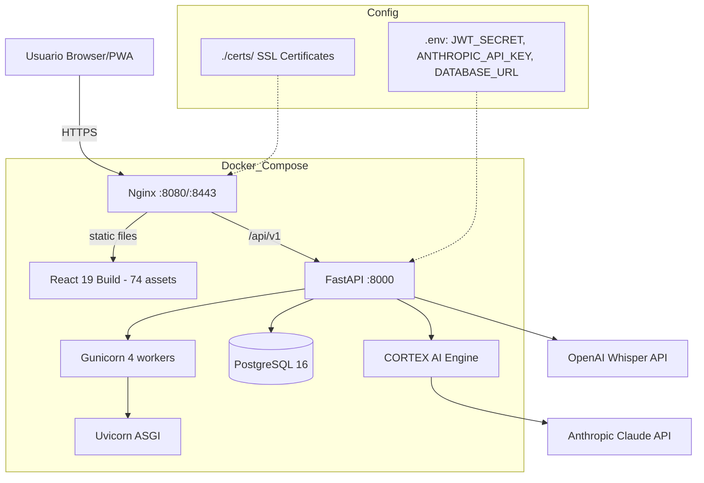

---

## 8. Diagrama de Secuencia — Captura de Campo a SAP

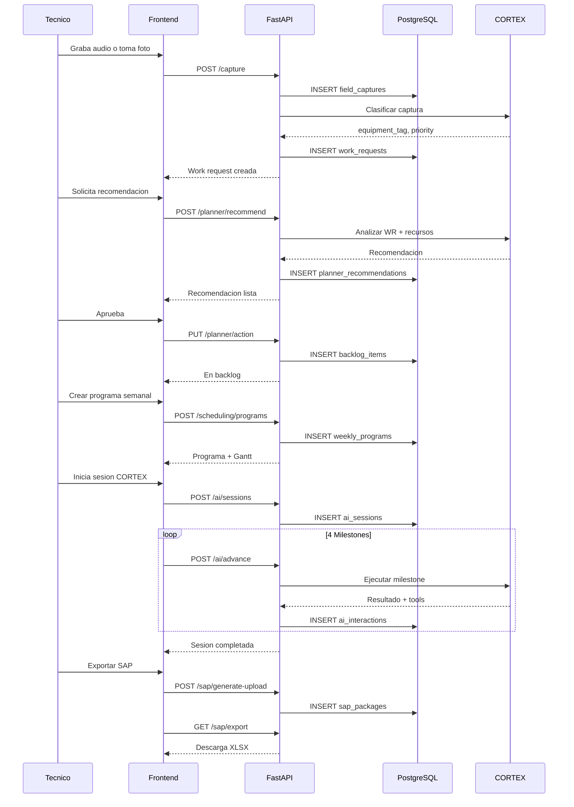

---

## 9. Diagrama de Estado — Work Request Lifecycle

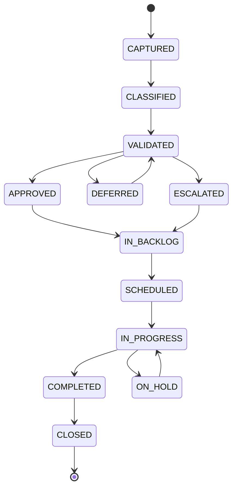

---

## 10. Diagrama C4 — Contexto del Sistema

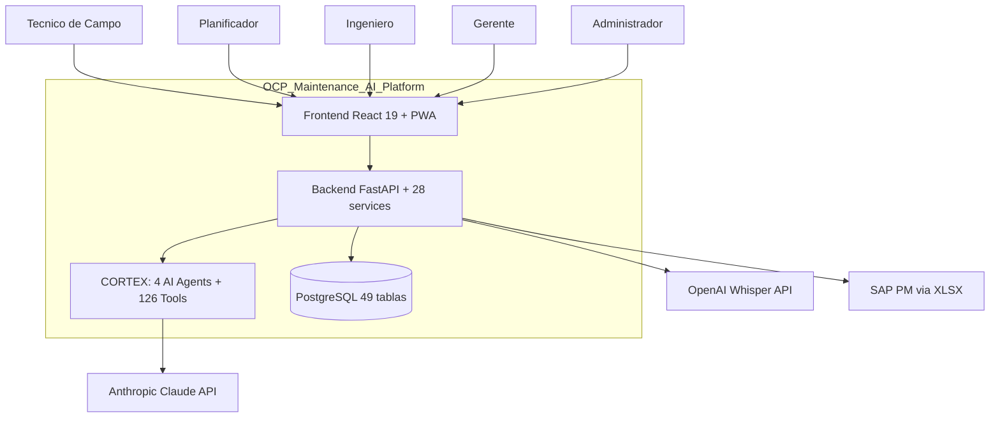

---

## 11. CORTEX AI — Arquitectura de Agentes

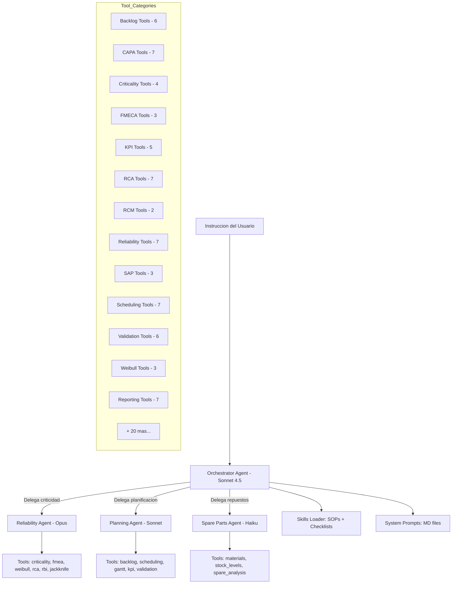

---

## 12. Frontend — Mapa de Paginas por Rol

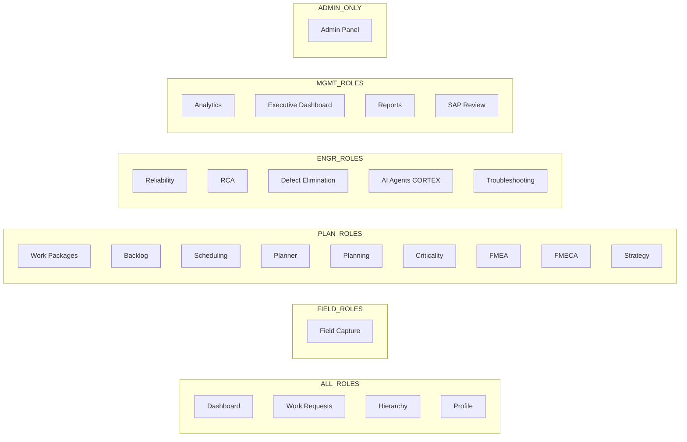

---

## Resumen de Metricas

| Metrica | Valor |
|---------|-------|
| Routers API | 20 |
| Endpoints totales | ~130 |
| Servicios backend | 28 |
| Tablas en DB | 49 |
| Agentes IA | 4 (Orchestrator, Reliability, Planning, Spare Parts) |
| Tool Wrappers | 43 modulos, 126+ herramientas |
| Paginas frontend | 25 |
| Componentes UI | 28 (8 custom + 20 shadcn/ui) |
| Funciones API client | 98 |
| Roles de usuario | 5 (admin, manager, planner, tecnico, engineer) |
| Idiomas soportados | 3 (es, en, ar) |
| Contenedores Docker | 3 (backend, frontend, nginx) |
